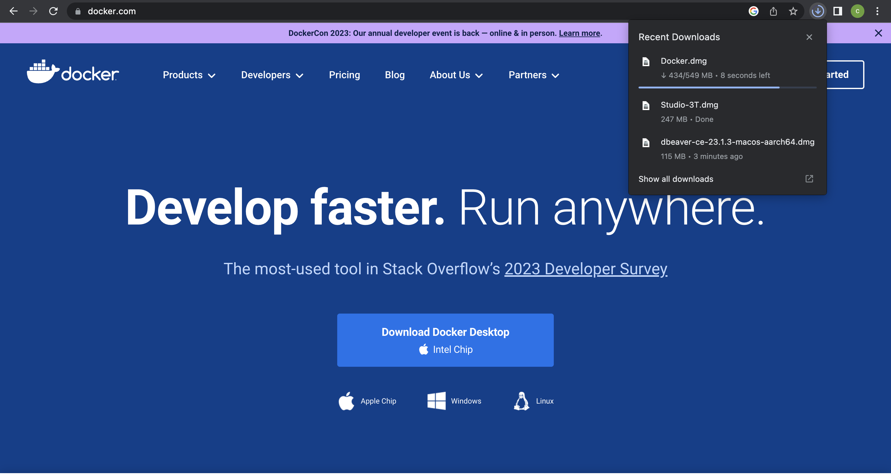
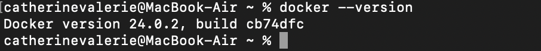
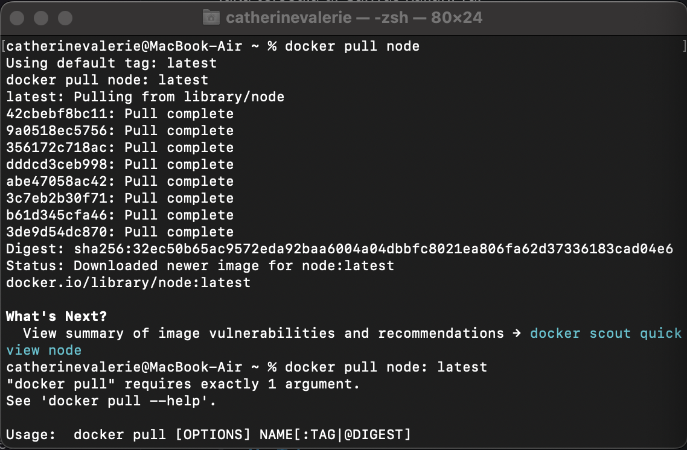
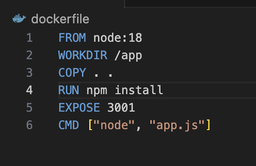
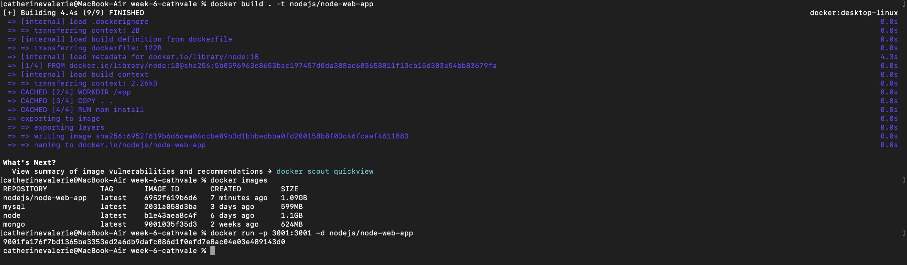
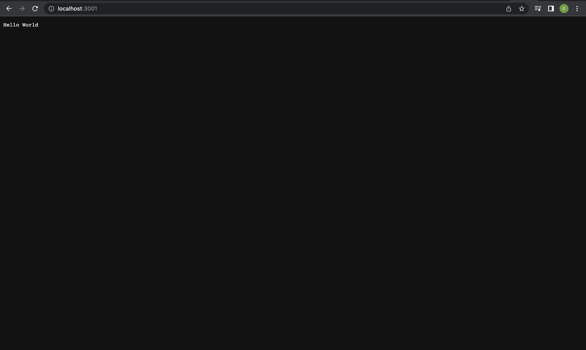

# Docker Assignment
The objective on this markdown is to give a step by step process of run node.js file using docker.

## 1. Download the Docker App

First, download the Docker App on google chrome or any website you use. Once the Docker is downloaded to your computer you can continue to the next step.

## 2. View Docker version on Terminal

Second, you can view the docker version via Terminal by using command "docker --version" after opening the docker app.

## 3. Pull Node image to Docker

Third, pull Node image to Docker via Terminal using command "docker pull node", and wait until the pull is completed

## 4. Create Dockerfile

Fourth, create the docker file with syntax as follow:
FROM node:18
WORKDIR /app
COPY . .
RUN npm install
EXPOSE 3001
CMD ["node", "app.js"]

## 5. Build and Run using Docker

Fifth, after the dockerfile is created build and run the docker using command : 
Build = "docker build . -t "your username"/node-web-app" 

Run = "docker run -p "port":"port" -d "your username"/node-web-app"

## 6. You can view the result on localhost

After the docker is run successfully, you can view the result by typing "localhost:*port on dockerfile*"